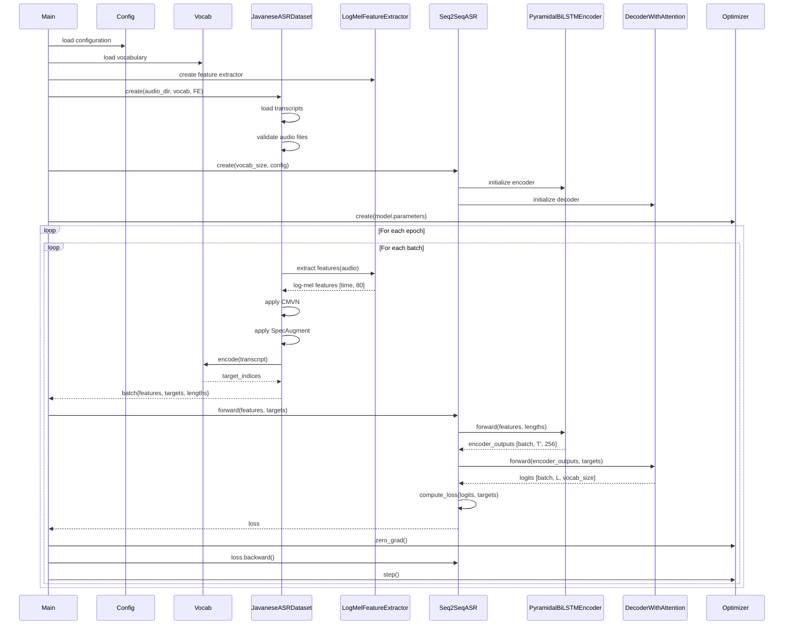
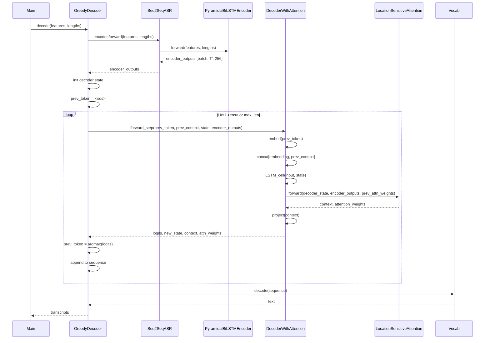
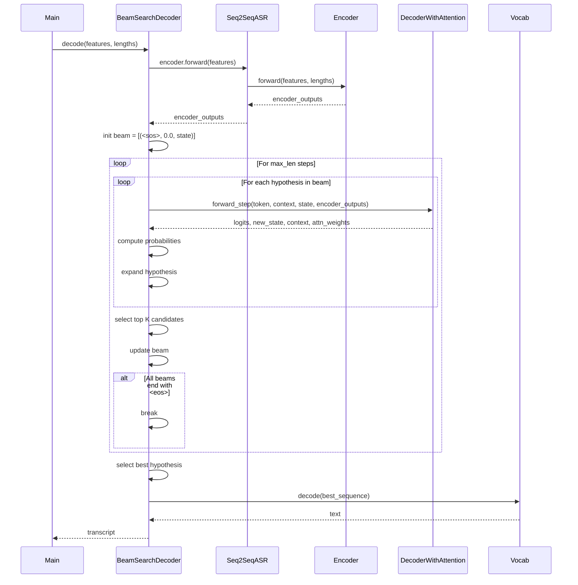
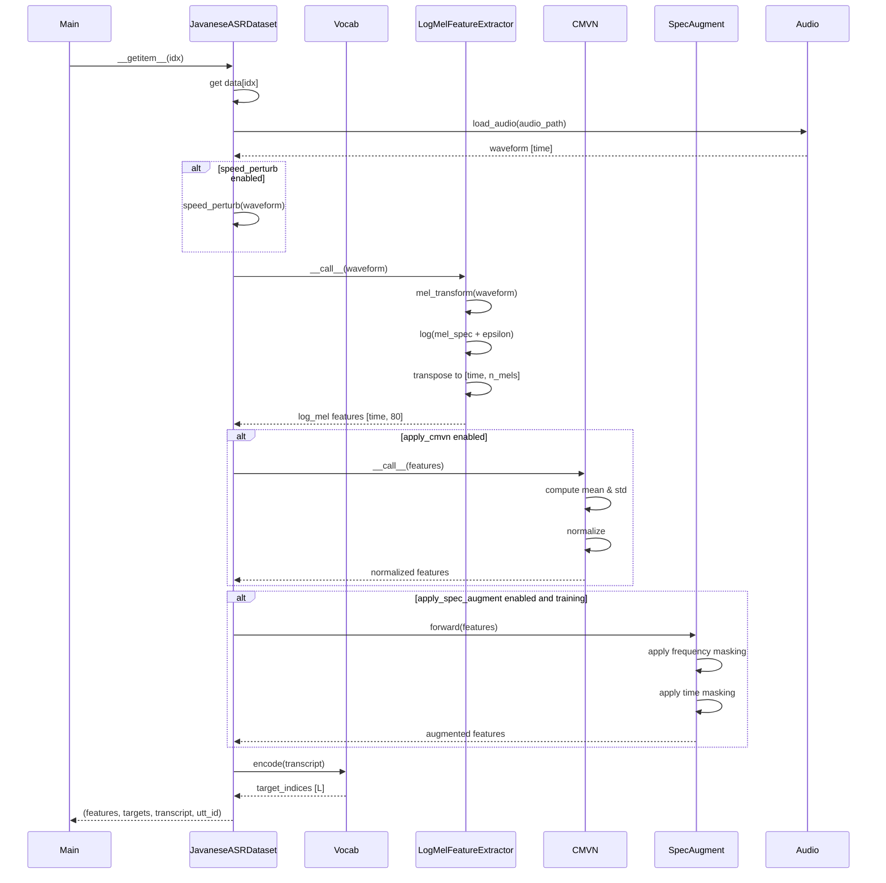
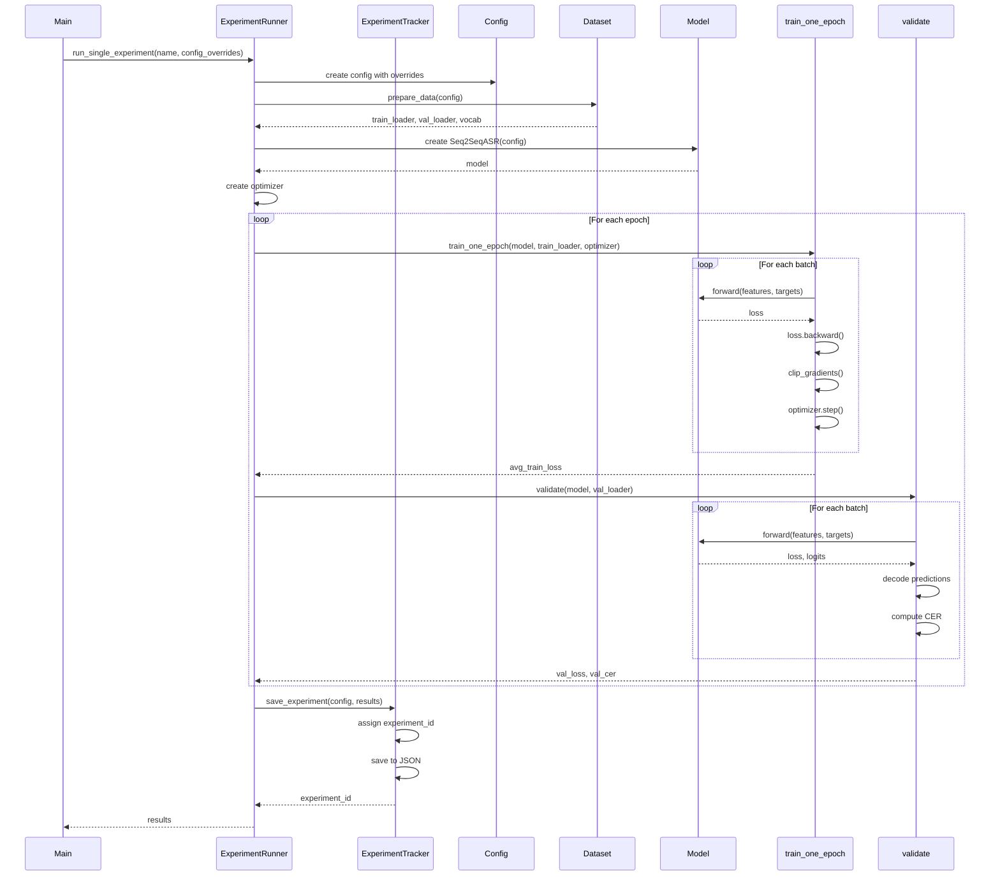
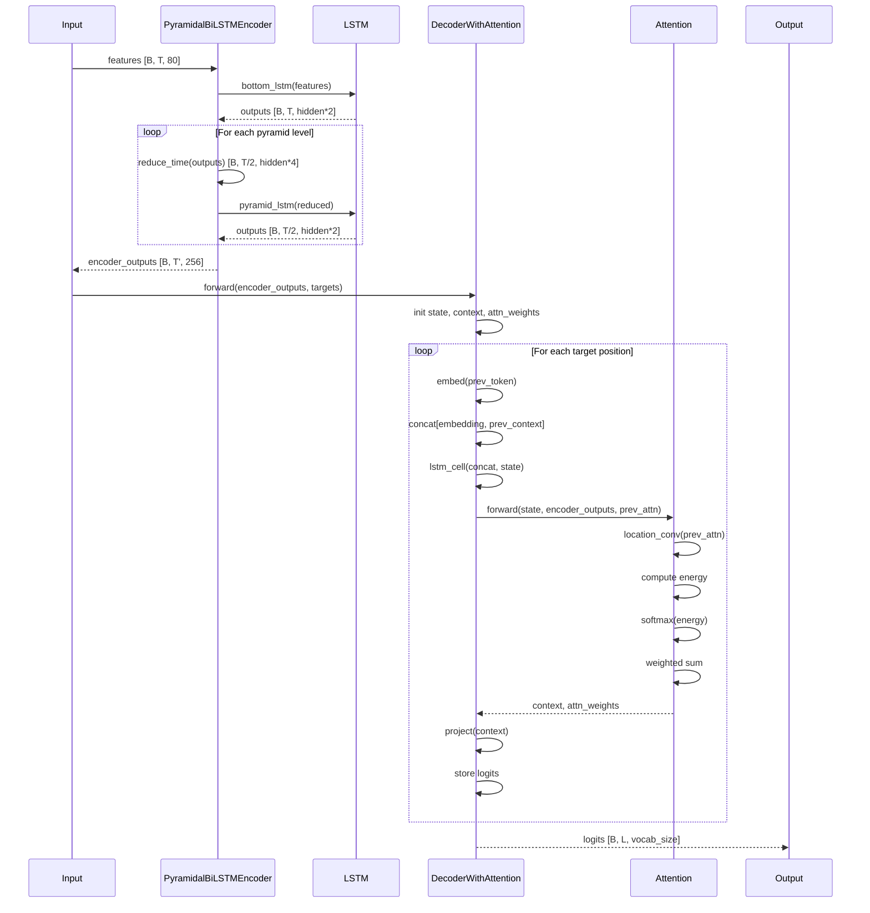

# Javanese ASR - Sequence Diagrams

## Training Sequence

## Inference Sequence (Greedy Decoding)

## Inference Sequence (Beam Search)

## Data Loading Sequence

## Experiment Runner Sequence

## Model Forward Pass Details

