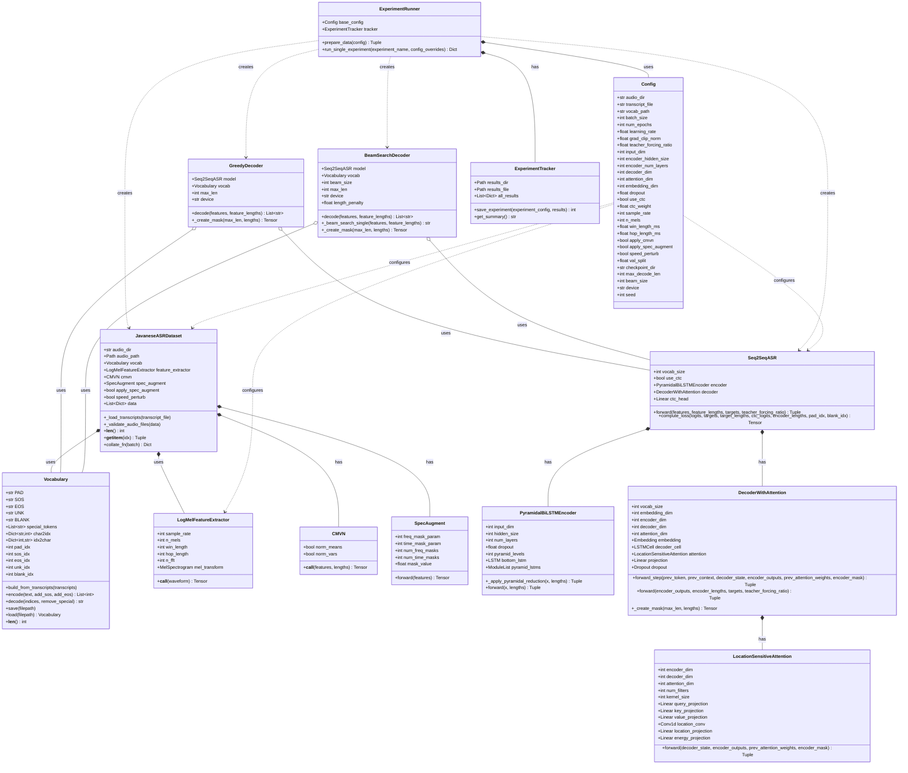
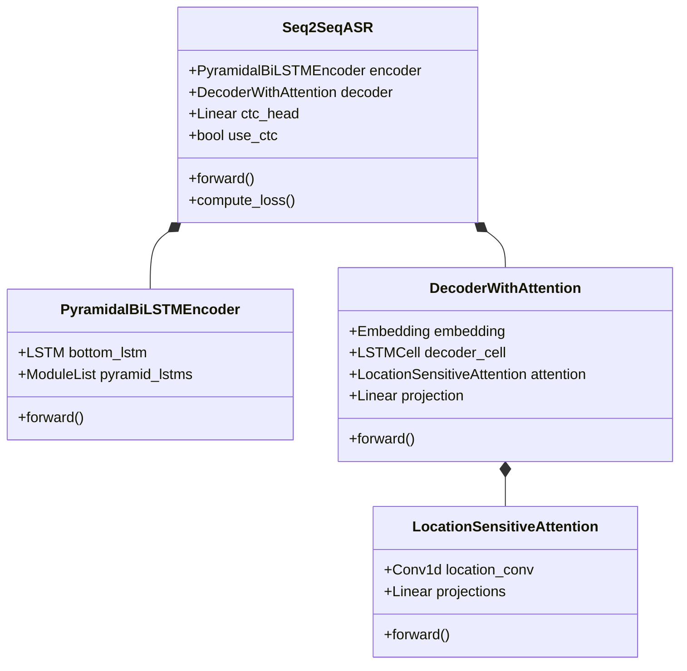
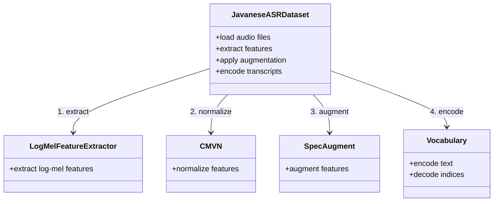
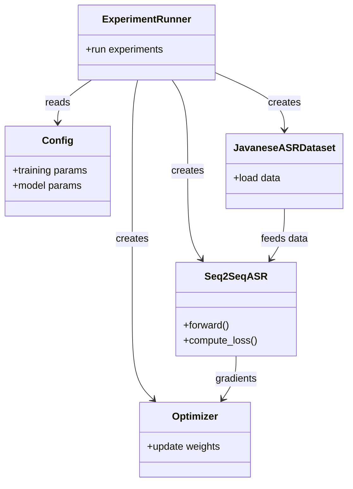
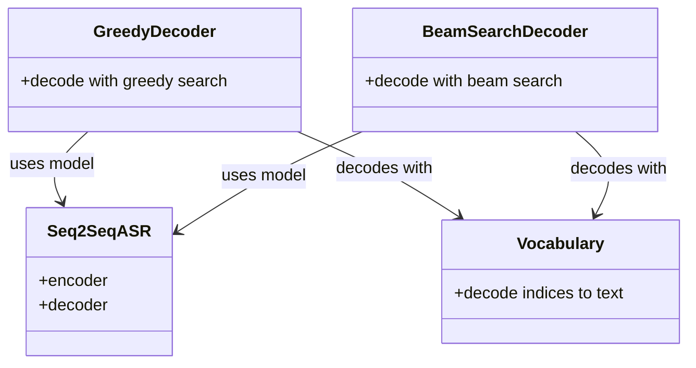

# Javanese ASR Class Diagram

## Complete System Architecture



## Simplified View: Core Model Architecture



## Data Pipeline Flow



## Training Flow



## Inference Flow



## Key Attributes Summary

### Model Hierarchy
```
Seq2SeqASR
├── encoder: PyramidalBiLSTMEncoder
│   ├── input_dim: 80 (mel features)
│   ├── hidden_size: 128
│   └── num_layers: 3
├── decoder: DecoderWithAttention
│   ├── vocab_size: from Vocabulary
│   ├── embedding_dim: 64
│   ├── decoder_dim: 256
│   ├── attention: LocationSensitiveAttention
│   │   ├── encoder_dim: 256
│   │   ├── decoder_dim: 256
│   │   └── attention_dim: 128
│   └── projection: Linear(decoder_dim, vocab_size)
└── ctc_head: Linear(hidden_size*2, vocab_size) [optional]
```

### Data Flow
```
Audio File (.wav)
    ↓
LogMelFeatureExtractor → [time, 80]
    ↓
CMVN (normalize) → [time, 80]
    ↓
SpecAugment (augment) → [time, 80]
    ↓
PyramidalBiLSTMEncoder → [reduced_time, 256]
    ↓
DecoderWithAttention → [target_len, vocab_size]
    ↓
Loss Computation (CrossEntropy + CTC)
```

### Configuration Dependencies
```
Config
├── Defines: audio_dir, transcript_file, vocab_path
├── Used by: JavaneseASRDataset
├── Defines: encoder_hidden_size, decoder_dim, etc.
├── Used by: Seq2SeqASR
├── Defines: sample_rate, n_mels
└── Used by: LogMelFeatureExtractor
```
